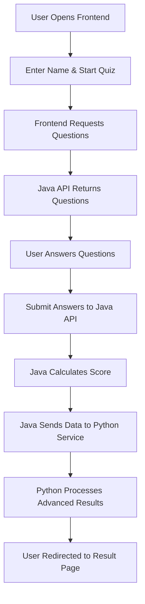

# 🧠 Three-Tier Quiz Application

A modern, microservices-based quiz application built with Java Spring Boot backend and Python Flask result processing service.

## 🚀 Features

### ✨ Core Functionality
- **Interactive Quiz Interface** - Modern, responsive web UI
- **Real-time Progress Tracking** - Visual progress bar and question counter
- **Intelligent Scoring** - Automatic answer validation and scoring
- **Advanced Result Processing** - Detailed analytics with grades and feedback
- **Beautiful Result Pages** - Professional Python-generated result displays

### 🏗️ Architecture Highlights
- **Three-Tier Architecture** - Clear separation of presentation, business, and data layers
- **Microservices Design** - Independent Java and Python services
- **RESTful APIs** - Clean API design for service communication
- **Multiple Databases** - H2 for quiz data, SQLite for result analytics
- **Cross-Platform** - Runs on Windows, macOS, and Linux

### 🎯 Technical Features
- **Responsive Design** - Works on desktop, tablet, and mobile
- **Keyboard Navigation** - Arrow keys and number keys for quick navigation
- **Error Handling** - Comprehensive error handling and user feedback
- **Data Persistence** - Automatic data saving and retrieval
- **Hot Reload** - Development-friendly with auto-restart capabilities

## 🛠️ Technology Stack

| Layer | Technology | Purpose |
|-------|------------|---------|
| **Frontend** | HTML5, CSS3, JavaScript | User interface and interaction |
| **Backend API** | Java 17, Spring Boot 3.1 | Business logic and data management |
| **Result Service** | Python 3.9, Flask | Advanced result processing |
| **Database** | H2 (in-memory), SQLite | Data persistence |
| **Build Tools** | Maven, pip | Dependency management |

## 📊 Application Flow



## 🎮 Sample Quiz Content

The application comes pre-loaded with sample questions covering:
- **General Knowledge** - Geography, history, and culture
- **Programming Concepts** - Java, web development, and algorithms
- **Technology Topics** - Databases, protocols, and best practices

## 📁 Project Structure

```
quiz-app/
├── 📂 src/main/java/com/example/quizapp/
│   ├── 🚀 QuizApplication.java           # Spring Boot main class
│   ├── 📂 controller/                    # REST API endpoints
│   ├── 📂 service/                       # Business logic layer
│   ├── 📂 model/                         # Data entities (JPA)
│   ├── 📂 repository/                    # Data access layer
│   └── 📂 config/                        # Configuration and data initialization
├── 📂 python-service/
│   ├── 🐍 result_service.py              # Flask result processing service
│   └── 📄 requirements.txt               # Python dependencies
├── 📂 frontend/
│   ├── 🌐 index.html                     # Main quiz interface
│   ├── 🎨 styles.css                     # Modern responsive styling
│   └── ⚡ script.js                      # Interactive functionality
├── 📂 Shell Scripts/
│   ├── 🧪 test-setup.sh                  # Environment validation
│   ├── ☕ start-java.sh                  # Java service launcher
│   ├── 🐍 start-python.sh                # Python service launcher
│   └── 🚀 start-all.sh                   # Complete application launcher
└── 📚 Documentation/
    ├── 📖 README.md                       # Quick start guide
    ├── 🏗️ ARCHITECTURE.md                # Detailed architecture
    ├── ⚙️ SETUP.md                       # Setup instructions
    └── 🤝 CONTRIBUTING.md                # Contribution guidelines
```

## 🌟 Key Highlights

### 🎨 Modern UI/UX
- Gradient backgrounds and smooth animations
- Card-based design with hover effects
- Progress indicators and visual feedback
- Mobile-first responsive design

### ⚡ Performance Optimized
- In-memory database for fast question retrieval
- Efficient API design with minimal data transfer
- Optimized frontend with modern JavaScript
- Lazy loading and smooth transitions

### 🔧 Developer Friendly
- Comprehensive documentation
- Easy setup with automated scripts
- Hot reload for development
- Clear separation of concerns

### 🚀 Production Ready
- Error handling and validation
- Logging and monitoring capabilities
- Scalable microservices architecture
- Database migration support

## 🎯 Use Cases

- **Educational Institutions** - Student assessments and practice tests
- **Corporate Training** - Employee skill evaluation and certification
- **Online Learning Platforms** - Interactive course assessments
- **Interview Preparation** - Technical skill testing
- **General Knowledge Testing** - Fun quizzes and competitions

## 🔮 Future Enhancements

- User authentication and profiles
- Quiz categories and difficulty levels
- Timer-based questions
- Leaderboards and competitions
- Question bank management
- Analytics dashboard
- Mobile app versions
- Multi-language support

## 📈 Scalability

The microservices architecture allows for:
- **Horizontal Scaling** - Deploy multiple instances of each service
- **Load Balancing** - Distribute traffic across service instances
- **Database Scaling** - Separate read/write operations
- **Caching** - Add Redis for improved performance
- **CDN Integration** - Serve static assets globally

This application serves as an excellent foundation for building more complex quiz and assessment systems while demonstrating modern software architecture principles.
